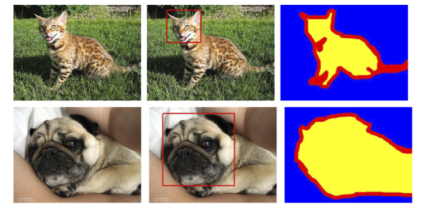
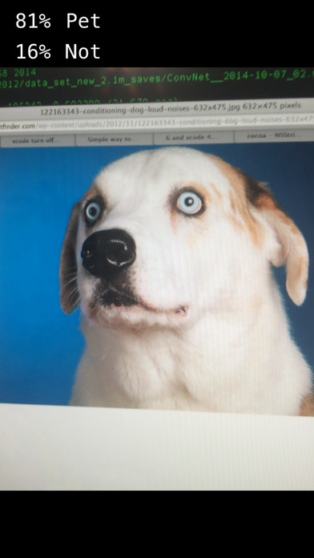

# 猫狗大战

## 注意：请不要直接使用网上公开的代码

[Dogs vs. Cats Redux: Kernels Edition
](https://www.kaggle.com/c/dogs-vs-cats-redux-kernels-edition)

## AWS

由于此项目要求的计算量较大，建议使用亚马逊 p3.2xlarge 云服务器来完成该项目，在使用 p3 之前，你可以先用 p2.xlarge 练手，参考：[在aws上配置深度学习主机 ](https://zhuanlan.zhihu.com/p/25066187)，[利用AWS学习深度学习](https://zhuanlan.zhihu.com/p/33176260)。

## 描述

使用深度学习方法识别一张图片是猫还是狗。

* 输入：一张彩色图片
* 输出：是猫还是狗

## 数据

此数据集可以从 kaggle 上下载。[Dogs vs. Cats Redux: Kernels Edition](https://www.kaggle.com/c/dogs-vs-cats-redux-kernels-edition/data)

此外还有一个数据集也非常好，可以作为扩充数据集或是做检测/分割问题：[The Oxford-IIIT Pet Dataset](http://www.robots.ox.ac.uk/~vgg/data/pets/)

## 建议

建议使用 OpenCV, tensorflow, Keras 完成该项目。其他的工具也可以尝试，比如 pytorch, mxnet 等。

* [OpenCV 项目](https://github.com/opencv/opencv)
* [tensorflow 项目主页](https://github.com/tensorflow/tensorflow)
* [Keras 项目主页](https://github.com/fchollet/keras)
* [OpenCV python tutorials](https://docs.opencv.org/master/d6/d00/tutorial_py_root.html)
* [Keras 英文文档](https://keras.io)
* [Keras 中文文档](https://keras.io/zh/)

### 建议模型

如果你不知道如何去构建你的模型，可以尝试以下的模型，后面的数字代表年份和月份：

* [VGGNet](https://arxiv.org/abs/1409.1556) 14.09
* [ResNet](https://arxiv.org/abs/1512.03385) 15.12
* [Inception v3](https://arxiv.org/abs/1512.00567) 15.12
* [InceptionResNetV2](https://arxiv.org/abs/1602.07261) 16.02
* [DenseNet](https://arxiv.org/abs/1608.06993) 16.08
* [Xception](https://arxiv.org/abs/1610.02357) 16.10
* [NASNet](https://arxiv.org/abs/1707.07012) 17.07

参考 Keras 文档：[Documentation for individual models](https://keras.io/applications/#documentation-for-individual-models)

## 最低要求

本项目的最低要求是 kaggle Public Leaderboard 前 10%。

参考链接：[https://www.kaggle.com/c/dogs-vs-cats-redux-kernels-edition/leaderboard](https://www.kaggle.com/c/dogs-vs-cats-redux-kernels-edition/leaderboard)

## 应用(可选)(推荐)

应用形式多种多样，可以是在本地调用摄像头跑的程序，也可以网页的，也可以是 iOS APP 或 Android APP，甚至可以是微信公众号或微信小程序。

### 网页应用

推荐的工具：

* [Flask](https://github.com/pallets/flask)
* [Flask 中文文档](http://docs.jinkan.org/docs/flask/)

### 微信公众号

可以参考这个例子：[微信数字识别](https://github.com/ypwhs/wechat_digit_recognition)。

网页接口部分可以参考 [Flask](https://github.com/pallets/flask) 而不必用 python cgi。

最新建议：可以使用小程序而不是公众号，小程序更合适。

### iOS

如果你使用 Keras 完成该项目，可以直接使用 Apple 提供的 [Core ML Tools](https://developer.apple.com/documentation/coreml/converting_trained_models_to_core_ml) 把训练出来的 Keras 模型直接转为 iOS 可以使用的模型。

当然在 iOS 平台上你也可以使用 [MetalPerformanceShaders](https://developer.apple.com/reference/metalperformanceshaders) 来实现卷积神经网络。

这里有一个 [Inception v3](https://github.com/shu223/iOS-10-Sampler/blob/master/iOS-10-Sampler/Samples/Inception3Net.swift) 在 iOS 上跑的例子，你可以参考，不过我们还是建议直接用上面的工具将 Keras 的模型转为 iOS 直接可以使用的模型。

OpenCV 的 iOS Framework 文件可以直接在这里下载：[OpenCV releases](https://github.com/opencv/opencv/releases)。这里有一份教程，可以轻松入门：[turorial_hello](https://docs.opencv.org/master/d7/d88/tutorial_hello.html)

最终效果可以参考这个 app ：[PetOrNot](https://itunes.apple.com/cn/app/petornot/id926645155)

### Android

在 Android 上运行 tensorflow 可以参考 [android tensorflow](https://github.com/tensorflow/tensorflow/tree/master/tensorflow/examples/android)。

在 Android 上运行 OpenCV 可以参考 [OpenCV4Android SDK](http://docs.opencv.org/master/da/d2a/tutorial_O4A_SDK.html)。

## 评估

你的项目会由优达学城项目评审师依照[机器学习毕业项目要求](https://review.udacity.com/#!/rubrics/1785/view)来评审。请确定你已完整的读过了这个要求，并在提交前对照检查过了你的项目。提交项目必须满足所有要求中每一项才能算作项目通过。

## 提交

* PDF 报告文件
* 数据预处理代码（jupyter notebook）
* 模型训练代码（jupyter notebook）
* 以上 notebook 导出的 html 文件
* 应用代码（可选）
* 包含使用的库，机器硬件，机器操作系统，训练时间等数据的 README 文档（建议使用 Markdown ）
